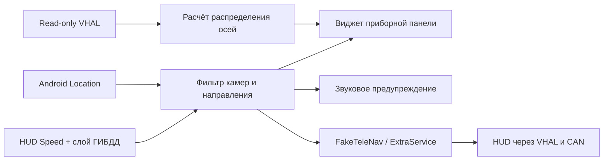

# Дорожный ассистент для EXEED

Экспериментальное Android-приложение для предупреждения о дорожных камерах,
вывода предупреждений на HUD и визуализации распределения момента в штатной
навигационной области приборной панели EXEED TXL2.

> Приложение не является штатным ПО производителя. Установка требует ADB и
> выполняется на ответственность владельца. Первую проверку проводите на
> стоящем автомобиле с включённым стояночным тормозом.

## Возможности

- предупреждение о камерах на приборной панели и звуковым сигналом;
- опциональное предупреждение на HUD со значком пункта оплаты, расстоянием и
  ограничением скорости;
- фильтрация камер по направлению движения и направлению контроля;
- дистанция предупреждения 400 м при скорости ниже 80 км/ч и 600 м при
  скорости от 80 км/ч;
- режим «всегда» или «только при превышении» для камер скорости;
- обновление российской базы HUD Speed из приложения с сохранением предыдущей
  рабочей версии для отката;
- визуализация распределения момента между передней и задней осями;
- автозапуск и ручное включение/выключение штатной навигационной области.
- чтение параметров 12-вольтовой батареи на совместимых прошивках EXEED.

В версии 2.11 исправлена ориентация осей AWD. Значение
`EstimatedCouplingTorque` относится к муфте задней оси, поэтому визуализация
использует:

```text
rear = calculatedValue * 2
front = 100 - rear
```

Чтение VHAL и исходная формула расчёта не изменялись.

## Быстрая установка

1. Включите ADB на головном устройстве и подключите автомобиль кабелем.
2. Установите Android Platform Tools и добавьте `adb` в `PATH` либо задайте
   `ANDROID_SDK_ROOT`.
3. Запустите:

```powershell
powershell -ExecutionPolicy Bypass -File .\install-car.ps1 `
  -ApkPath .\road-assistant-2.18.apk
```

Скрипт проверяет, что подключено ровно одно авторизованное устройство,
устанавливает APK поверх предыдущей версии без очистки настроек, выдаёт
разрешения геолокации и открывает приложение.

Пакет приложения: `com.example.instrumentawdprobe`.

## Сборка из исходников

Требуются Windows PowerShell, JDK 17, Android SDK с platform/build-tools и
apktool 3.x. Задайте `JAVA_HOME`, `ANDROID_SDK_ROOT`; apktool должен быть в
`PATH` либо путь к JAR задаётся переменной `APKTOOL_JAR`.

```powershell
powershell -ExecutionPolicy Bypass -File .\test.ps1
powershell -ExecutionPolicy Bypass -File .\build.ps1
powershell -ExecutionPolicy Bypass -File .\build.ps1 -NoHud
```

Подписанный отладочным ключом APK появится в
`build\exeed-awd-display.apk`. Вариант без отправки данных на HUD появится в
`build-nohud\exeed-awd-display-nohud.apk`. Локальный ключ создаётся в `.debug`
и намеренно не публикуется.

Подробности находятся в [DEVELOPMENT.md](DEVELOPMENT.md), сценарий безопасной
проверки — в [TESTING.md](TESTING.md).

## Управление извне

```powershell
adb shell am broadcast -a com.example.instrumentawdprobe.action.SHOW_AWD
adb shell am broadcast -a com.example.instrumentawdprobe.action.HIDE_AWD
```

## Источники данных

В тестовый APK включена база HUD Speed/RadarBase. Обновление загружается с
`https://dwn.jcartools.ru/arad/h_ru.zip`. Региональные точки из открытых
публикаций ГИБДД не смешиваются с основной базой, чтобы исключить дубли и
всенаправленные предупреждения без ограничения скорости.

Формат основной базы:

```text
IDX,X,Y,TYPE,SPEED,DIRTYPE,DIRECTION,DISTANCE,ANGLE
```

Права на сторонние данные не передаются вместе с исходным кодом приложения.
Перед повторным распространением или коммерческим использованием проверьте
условия владельцев соответствующих наборов данных. См. [NOTICE.md](NOTICE.md).

## Ограничения

- Интеграция с приборной панелью и HUD зависит от сервисов конкретной прошивки
  EXEED; на других автомобилях эти функции могут быть недоступны.
- Направление определяется по GPS-курсу либо по накопленному перемещению, поэтому
  на малой скорости возможна задержка выбора камеры.
- Сигналы силовой установки и полного привода читаются без изменения. При
  включённом HUD приложение записывает только штатные навигационные свойства
  расстояния до манёвра и временной конечной точки; IPKService переключает
  навигационную область между режимами `MINI` и `RESET`.
- Проект опубликован для исследования и тестирования без отдельной лицензии на
  коммерческое использование.

## Архитектура



## Версии

Изменения перечислены в [CHANGELOG.md](CHANGELOG.md).
