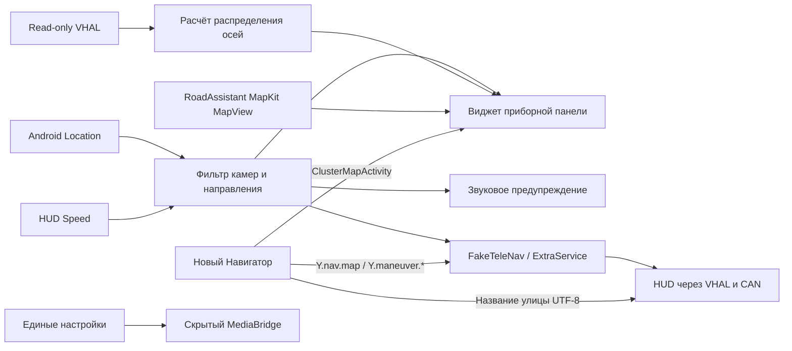

# Дорожный ассистент для EXEED

Экспериментальное Android-приложение для предупреждения о дорожных камерах,
вывода предупреждений на HUD, визуализации распределения момента и карты
MapKit в штатной навигационной области приборной панели EXEED TXL2.

> Приложение не является штатным ПО производителя. Установка требует ADB и
> выполняется на ответственность владельца. Первую проверку проводите на
> стоящем автомобиле с включённым стояночным тормозом.

## Возможности

- предупреждение о камерах на приборной панели и звуковым сигналом;
- опциональное предупреждение на HUD со значком пункта оплаты, расстоянием и
  ограничением скорости;
- фильтрация камер по направлению движения и направлению контроля;
- дистанция предупреждения 400 м при скорости ниже 80 км/ч и 600 м при
  скорости от 80 км/ч;
- режим «всегда» или «только при превышении» для камер скорости;
- обновление российской базы HUD Speed из приложения с сохранением предыдущей
  рабочей версии для отката;
- визуализация распределения момента между передней и задней осями;
- экспериментальный режим карты с положением автомобиля, направлением,
  пробками и автоматической дневной/ночной темой;
- выбор малого режима приборной панели: полный привод, прозрачная заглушка,
  антирадар или активный маршрут;
- автозапуск и ручное включение/выключение штатной навигационной области.
- чтение параметров 12-вольтовой батареи на совместимых прошивках EXEED.
- единый экран настроек скрытых компонентов MediaBridge и FakeTeleNav;
- запуск полноэкранного нового Яндекс Навигатора на приборной панели и возврат в мини-режим.
- выбор положения карточки следующего манёвра в полноэкранной карте;
- повторная доставка русского названия следующей улицы в физический HUD без
  нарушения приоритета предупреждений антирадара.
- одновременный вывод активного манёвра Навигатора на HUD и в штатную
  TBT-карточку приборки; карточка сохраняется при мини-карте и отключается
  только в полноэкранном режиме.
- приём GPS телефона для антирадара через локальный Wi‑Fi с защищённым кодом
  сопряжения и автоматическим возвратом к GPS автомобиля.

## GPS телефона по Wi‑Fi

Установите `PhoneGpsBridge` на телефон. В Дорожном ассистенте включите
«Использовать GPS телефона по Wi‑Fi», скопируйте показанный код в приложение
телефона и включите передачу. Оба устройства должны быть в одной сети
хот-спота; по умолчанию телефон отправляет широковещательно на
`255.255.255.255:44888`. Если хот-спот блокирует broadcast, укажите в телефоне
локальный IP головного устройства. Этот канал применяется только к Дорожному
ассистенту и антирадару: штатному Яндекс Навигатору mock-location не передаётся.

В версии 2.11 исправлена ориентация осей AWD. Значение
`EstimatedCouplingTorque` относится к муфте задней оси, поэтому визуализация
использует:

```text
rear = calculatedValue * 2
front = 100 - rear
```

Чтение VHAL и исходная формула расчёта не изменялись.

## Быстрая установка

1. Включите ADB на головном устройстве и подключите автомобиль кабелем.
2. Установите Android Platform Tools и добавьте `adb` в `PATH` либо задайте
   `ANDROID_SDK_ROOT`.
3. Запустите:

```powershell
powershell -ExecutionPolicy Bypass -File .\install-car.ps1 `
  -ApkPath .\RoadAssistant-2.68-phone-gps-bridge.apk
```

Скрипт проверяет, что подключено ровно одно авторизованное устройство,
устанавливает APK поверх предыдущей версии без очистки настроек, выдаёт
разрешения геолокации и открывает приложение.

Пакет приложения: `com.example.instrumentawdprobe`.

## Полный навигационный комплект

Для всех функций используются три наших приложения:

1. [FakeTeleNav](https://github.com/DmitryRND/exeed-fake-telenav) — штатный
   TeleNav/IPK/HUD-адаптер для физического HUD и приборной TBT-карточки.
2. [Yandex Media Bridge](https://github.com/DmitryRND/exeed-yandex-media-bridge) —
   карточка активного маршрута и интеграция Яндекс Музыки со штатным Launcher.
3. Road Assistant — единые настройки, антирадар, мини-карта и полноэкранный
   запуск Навигатора на приборке.

Готовые APK собраны вместе в GitHub Release этого репозитория. Устанавливайте
их в порядке FakeTeleNav → MediaBridge → Road Assistant. Новый Яндекс
Навигатор `ru.yandex.yandexnavi` устанавливается отдельно и не распространяется
в этом репозитории.

## Сборка из исходников

Требуются Windows PowerShell, JDK 21 и Android SDK. Скопируйте
`local.properties.example` в `local.properties`, задайте путь к SDK и свой
ключ Yandex MapKit. Ключ не должен попадать в Git.

```powershell
powershell -ExecutionPolicy Bypass -File .\test.ps1
powershell -ExecutionPolicy Bypass -File .\build.ps1
powershell -ExecutionPolicy Bypass -File .\build.ps1 -NoHud
```

Подписанный отладочным ключом APK появится в
`build\exeed-awd-display.apk`. Вариант без отправки данных на HUD появится в
`build-nohud\exeed-awd-display-nohud.apk`. Сборка выполняется Gradle и включает
MapKit Full для `arm64-v8a`. Локальный ключ подписи создаётся в `.debug` и
намеренно не публикуется.

Подробности находятся в [DEVELOPMENT.md](DEVELOPMENT.md), сценарий безопасной
проверки — в [TESTING.md](TESTING.md).

## Управление извне

```powershell
adb shell am broadcast -a com.example.instrumentawdprobe.action.SHOW_AWD
adb shell am broadcast -a com.example.instrumentawdprobe.action.HIDE_AWD
```

## Источники данных

В тестовый APK включена база HUD Speed/RadarBase. Обновление загружается с
`https://dwn.jcartools.ru/arad/h_ru.zip`. Региональные точки из открытых
публикаций ГИБДД не смешиваются с основной базой, чтобы исключить дубли и
всенаправленные предупреждения без ограничения скорости.

Формат основной базы:

```text
IDX,X,Y,TYPE,SPEED,DIRTYPE,DIRECTION,DISTANCE,ANGLE
```

Права на сторонние данные не передаются вместе с исходным кодом приложения.
Перед повторным распространением или коммерческим использованием проверьте
условия владельцев соответствующих наборов данных. См. [NOTICE.md](NOTICE.md).

## Ограничения

- Интеграция с приборной панелью и HUD зависит от сервисов конкретной прошивки
  EXEED; на других автомобилях эти функции могут быть недоступны.
- Малые режимы антирадара и маршрута требуют Android 8/API 26+, интернет, GPS
  и API-ключ MapKit. Маршрутный режим рисует полилинию, манёвр и общий
  прогресс из `Y.nav.map`. До появления свежей позиции Навигатора и после
  четырёх секунд тишины камера следует за проверенным GPS автомобиля/телефона;
  слой пробок включается после запуска MapView. После пяти минут без маршрута
  данные очищаются. Полноэкранный режим на приборке запускает непосредственно
  `ClusterMapActivity` нового Навигатора.
- Направление определяется по GPS-курсу либо по накопленному перемещению, поэтому
  на малой скорости возможна задержка выбора камеры.
- Сигналы силовой установки и полного привода читаются без изменения. При
  включённом HUD приложение записывает только штатные навигационные свойства
  расстояния до манёвра и временной конечной точки; IPKService переключает
  навигационную область между режимами `MINI` и `RESET`.
- Проект опубликован для исследования и тестирования без отдельной лицензии на
  коммерческое использование.

## Архитектура



## Версии

Изменения перечислены в [CHANGELOG.md](CHANGELOG.md).
